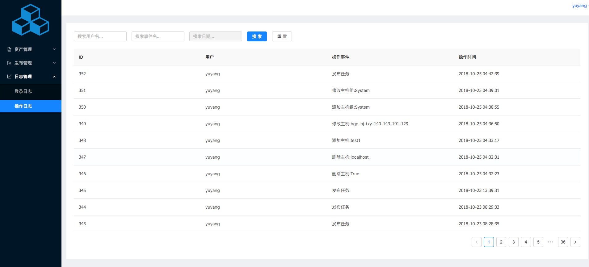

## ansible-cmdb-platform

### dashboard

### assets manager

### machine collection 
Collect device hardware based on ansible fact, which can be updated and synchronized with device information or manually edited and modified

#### group manager

#### ansible dispatch manager
Remote calls based on ansible api, including linux cmd commands, ansible ad-hoc, play-book

#### cronjob manager

#### audit log manager

### architecture
``
backend: djangp2
frontend: react
``
